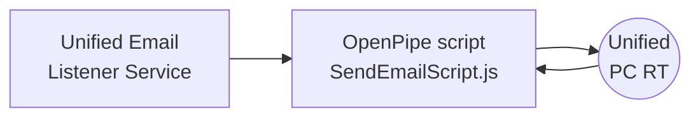
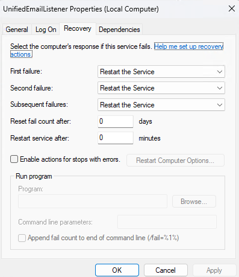
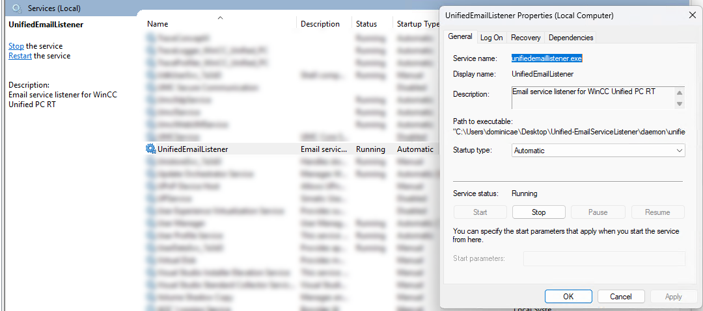
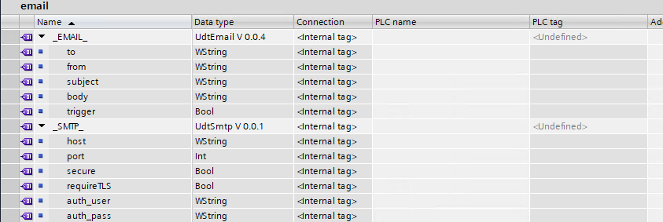

# Unified Email Listener Service
A small piece of software that runs as a `windows service` that executes an OpenPipe script (`SendEmailScript.js`) that subscribe to some variables in the locally running `WinCC Unified PC RT` application. 

I based my script on the example provided in ***DVD2*** of the TIA Portal V20 installation, with the OpenPipe SDK Comfort API `SendEmailSampleViaComfortLayer.js` and adapted the Tags it subscribes to, to fit my example.

I also provide in this example how we can leverage the npm module [node-windows](https://www.npmjs.com/package/node-windows) to run a JavaScript file "as a service" in a Windows environment.

## Installation steps
1. **Download** the file package `Unified-EmailListenerService.zip` from this repository.
2. **Unzip** the files to any location on the WinCC Unified PC RT station.
3. **Run** the `install.bat` file to install the service.
4. **Run windows** `services.msc` and search for the **UnifiedEmailListener** service.
i. Access the **Recovery tab** in the service properties.
ii. **Set** the **first**, **second** and **subsequent failures** values to **Restart the Service**.
iii. **Set** the value of **Restart service after** to **0** minutes
iv. Click **Apply** and **OK**.
v. Access the **General tab** in the service property.
vi. Make sure the service **Startup type** is set to **Automatic**.
vii. **Start** the service.

## Uninstallation step
1. **Run** the `uninstall.bat` file to install the service.
*Will delete the service even if it's currently running.

## Steps in TIA Portal
1. **Download** the file `Unified-EmailListenerLibrary.zal20` from this repository and open it in the **Global libraries** area of TIA Portal.

***The library*** provided contains:
1. UDT types:
i. `udtSmtp` that contains the elements for the **SMTP configuration**.
ii. `udtEmail` that contains the **email parameters**; to, from, subject and content, but also the trigger bit.
2. Master copies that contains:
i. Example tag table `email` that contains two tags with the UDT's.
ii. Example of usage (`BasicExample` & `AlarmToEmailExample`).

***Engineering*** a project:
1. Simply create two internal tags named:
i. `_SMTP_` of datatype **UdtSmtp**.
ii. `_EMAIL_` of datatype **UdtEmail**.

## Tested scope

This has only be tested with `WinCC Unified PC RT V20`.
# Disclaimer:

>  The examples are non-committal and do not lay any claim to completeness with regard to configuration and equipment as well as any eventualities. The examples do not represent any custom-designed solutions but shall offer only support at typical tasks. You are accountable for the proper mode of the described products yourself.
> 
>  These examples do not discharge you from the obligation to safe dealing for application, installation, business and maintenance. By use of these examples, you appreciate that Siemens cannot be made liable for possible damages beyond the provisions regarding described above. We reserve us the right to carry out changes at these examples without announcement at any time. The contents of the other documentation have priority at deviations between the suggestions in these examples and other Siemens publications, such as catalogues  and manuals.
>  > Use at your own risk.
